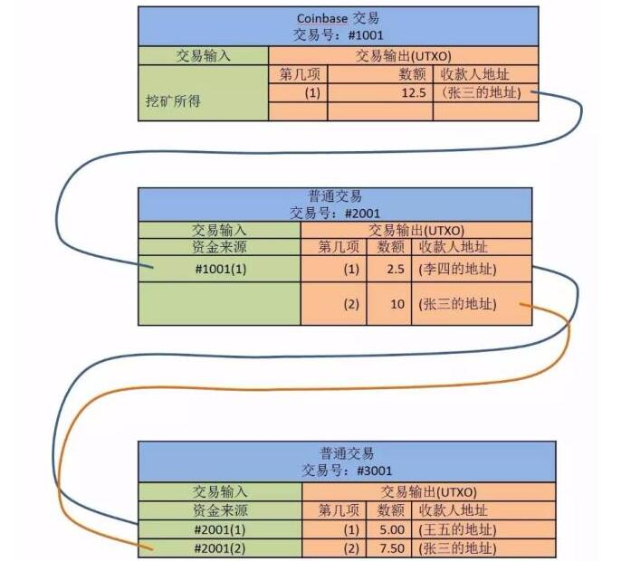

[区块链](https://www.cnblogs.com/zhuweiheng/p/8206188.html)    
[区块链的一些代码](https://www.jianshu.com/p/8a2ee79382f5)    
[面向 Java 开发人员的区块链链代码](https://blog.csdn.net/simple_chao/article/details/73648299)    
感觉上是一个通过将所有信息链式公开化而形成的的一个不可更改的的信息块链

通过加密算法保证主题内容的Hash值的不可重复，通过“六次确认”来进行分叉有效性的鉴别

[解密区块链存储机制](http://wemedia.ifeng.com/64550868/wemedia.shtml)    

存储UTXO（Unspent Transaction Output）    
一笔交易块记录交易双方的所有交易数据买方以及卖方的相关信息，相较于传统流水，在交易的进行过程中同时会对涉及到的交易输入信息进行“重组”，生成新的交易输出消息并且“重组”前后的交易金额不变（所以说在进行重组的过程中，尽管对应交易输入方的部分金额没有发生变动，仍会创建一笔对象为自己的新的交易输出记录）。    

