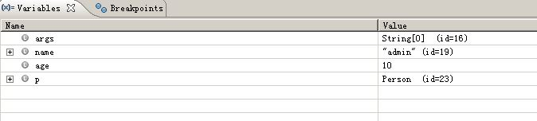
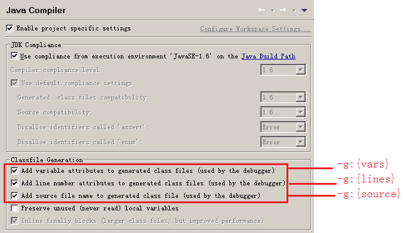

# 转自[xiazdong_javac命令初窥](http://www.cnblogs.com/xiazdong/p/3216220.html)

用法: javac <options> <source files>
其中, 可能的选项包括:
```
  -g                         生成所有调试信息
  -g:none                    不生成任何调试信息
  -g:{lines,vars,source}     只生成某些调试信息
  -nowarn                    不生成任何警告
  -verbose                   输出有关编译器正在执行的操作的消息
  -deprecation               输出使用已过时的 API 的源位置
  -classpath <路径>            指定查找用户类文件和注释处理程序的位置
  -cp <路径>                   指定查找用户类文件和注释处理程序的位置
  -sourcepath <路径>           指定查找输入源文件的位置
  -bootclasspath <路径>        覆盖引导类文件的位置
  -extdirs <目录>              覆盖所安装扩展的位置
  -endorseddirs <目录>         覆盖签名的标准路径的位置
  -proc:{none,only}          控制是否执行注释处理和/或编译。
  -processor <class1>[,<class2>,<class3>...] 要运行的注释处理程序的名称; 绕过默认的搜索进程
  -processorpath <路径>        指定查找注释处理程序的位置
  -d <目录>                    指定放置生成的类文件的位置
  -s <目录>                    指定放置生成的源文件的位置
  -implicit:{none,class}     指定是否为隐式引用文件生成类文件
  -encoding <编码>             指定源文件使用的字符编码
  -source <发行版>              提供与指定发行版的源兼容性
  -target <发行版>              生成特定 VM 版本的类文件
  -version                   版本信息
  -help                      输出标准选项的提要
  -A关键字[=值]                  传递给注释处理程序的选项
  -X                         输出非标准选项的提要
  -J<标记>                     直接将 <标记> 传递给运行时系统
  -Werror                    出现警告时终止编译
  @<文件名>                     从文件读取选项和文件名
```
## -g、-g:none、-g:{lines,vars,source}
-g：在生成的class文件中包含所有调试信息（行号、变量、源文件）
-g:none ：在生成的class文件中不包含任何调试信息。
这个参数在javac编译中是看不到什么作用的，因为调试信息都在class文件中，而我们看不懂这个class文件。

为了看出这个参数的作用，我们在eclipse中进行实验。在eclipse中，我们经常做的事就是“debug”，而在debug的时候，我们会

加入“断点”，这个是靠-g:lines起作用，如果不记录行号，则不能加断点。
在“variables”窗口中查看当前的变量，如下图所示，这是靠-g:vars起作用，否则不能查看变量信息。
在多个文件之间来回调用，比如 A.java的main()方法中调用了B.java的fun()函数，而我想看看程序进入fun()后的状态，这是靠-g:source，如果没有这个参数，则不能查看B.java的源代码。


在eclipse中，假设有一个名为 Test 的项目，则可以"右击Test项目" -> "Properties" -> "Java compiler"，进入下图界面。

  .jpg)
上面用红色方框圈起来的选项，作用就等价于 -g:vars,-g:lines,-g:source。

下面来做几个试验：

实验一：

* 实验内容：去掉全部的三个选项。
* 结论：不能进行调试，因为不能加断点，不能查看当前的变量。

实验二：

* 实验内容：只去掉第1个选项。
* 结论：在“variables”窗口中，没有记录任何变量。

实验三：

* 实验内容：去掉第2个选项。
* 结论：不能加BreakPoint。

实验四：

* 实验内容：去掉第3个选项。
* 结论：如果要查看其它文件，则出现： source not found.

## -bootclasspath、-extdirs
-bootclasspath和-extdirs 几乎不需要用的，因为他是用来改变 “引导类”和“扩展类”。

* 引导类(组成Java平台的类)：Java\jdk1.7.0_25\jre\lib\rt.jar等，用-bootclasspath设置。
* 扩展类：Java\jdk1.7.0_25\jre\lib\ext目录中的文件，用-extdirs设置。
* 用户自定义类：用-classpath设置。

我们用-verbose编译后出现的“类文件的搜索路径”，就是由上面三个路径组成，如下：

```
[类文件的搜索路径: C:\Java\jdk1.7.0_25\jre\lib\resources.jar,C:\Java\jdk1.7.0_25
\jre\lib\rt.jar,C:\Java\jdk1.7.0_25\jre\lib\sunrsasign.jar,C:\Java\jdk1.7.0_25\j
re\lib\jsse.jar,C:\Java\jdk1.7.0_25\jre\lib\jce.jar,C:\Java\jdk1.7.0_25\jre\lib\
charsets.jar,C:\Java\jdk1.7.0_25\jre\lib\jfr.jar,C:\Java\jdk1.7.0_25\jre\classes
,C:\Java\jdk1.7.0_25\jre\lib\ext\access-bridge-32.jar,C:\Java\jdk1.7.0_25\jre\li
b\ext\dnsns.jar,C:\Java\jdk1.7.0_25\jre\lib\ext\jaccess.jar,C:\Java\jdk1.7.0_25\
jre\lib\ext\localedata.jar,C:\Java\jdk1.7.0_25\jre\lib\ext\sunec.jar,C:\Java\jdk
1.7.0_25\jre\lib\ext\sunjce_provider.jar,C:\Java\jdk1.7.0_25\jre\lib\ext\sunmsca
pi.jar,C:\Java\jdk1.7.0_25\jre\lib\ext\sunpkcs11.jar,C:\Java\jdk1.7.0_25\jre\lib
\ext\zipfs.jar,..\bin]             // 最后一个为用户自定义，其余为引导类和扩展类路径
```

如果利用 -bootclasspath 重新定义： javac -bootclasspath src Xxx.java，则会出现下面错误：

`致命错误: 在类路径或引导类路径中找不到程序包 java.lang`

## -sourcepath和-classpath（-cp）
* -classpath(-cp)指定你依赖的类的class文件的查找位置。在Linux中，用“:”分隔classpath，而在windows中，用“;”分隔。
* -sourcepath指定你依赖的类的java文件的查找位置。

举个例子，

```
public class A
{
    public static void main(String[] args) {
        B b = new B();
        b.print();
    }
}
```

```
public class B
{
    public void print()
    {
        System.out.println("old");
    }
}
```

目录结构如下：

```
sourcepath          //此处为当前目录
　　|-src
　　　　|-com
　　　　　　|- B.java
　　　　|- A.java
　　|-bin
　　　　|- B.class               //是 B.java 编译后的类文件
```
如果要编译 A.java，则必须要让编译器找到类B的位置，你可以指定B.class的位置，也可以是B.java的位置，也可以同时都存在。
```
javac -classpath bin src/A.java                            //查找到B.class
javac -sourcepath src/com src/A.java                   //查找到B.java
javac -sourcepath src/com -classpath bin src/A.java    //同时查找到B.class和B.java
```
如果同时找到了B.class和B.java，则：

* 如果B.class和B.java内容一致，则遵循B.class。
* 如果B.class和B.java内容不一致，则遵循B.java，并编译B.java。
以上规则可以通过 -verbose选项看出。

## -proc:{none,only}、-procpath、-processor
这三个命令是用来自定义“Annotation Processor”的，即你可以自定义注释，比如@Hello，@First 等，解析这些注释就需要"Annotation Processor"。

* -processor <CustomProcessor> ：自定义注释处理器的类
* -procpath：注释处理器的查找目录。
* -proc:only：只运行注释处理器，而不编译源文件。
* -proc:none：不使用注释处理器，只编译源文件。

**任务**：自定义一个@HelloWorld 注释，并自定义注释处理器“HelloWorldProcessor”，使得在javac编译时输出：HelloWorld.

第一步：定义 @HelloWorld注释。

public @interface HelloWorld
{    
}

第二步：使用@HelloWorld注释。

@HelloWorld
public class Dummy
{
}

第三步：编写注释处理器 HelloWorldProcessor。

必须要继承 AbstractProcessor.
对于process方法，每个Annotation都会调用process()方法一次。
```
 1 import java.util.Set;
 2 import javax.annotation.processing.*;
 3 import javax.lang.model.SourceVersion;
 4 import javax.lang.model.element.TypeElement;
 5 import javax.tools.Diagnostic;
 6
 7 @SupportedAnnotationTypes("HelloWorld")            //注释处理器支持的注释：HelloWorld
 8 @SupportedSourceVersion(SourceVersion.RELEASE_7)        //注释处理器支持的JDK版本：7
 9 public class HelloWorldProcessor extends AbstractProcessor {        //继承 AbstractProcessor
10      @Override
11      public synchronized void init(ProcessingEnvironment processingEnv)
12      {
13          super.init(processingEnv);
14      }
15
16      @Override
17      public boolean process(Set<? extends TypeElement> annotations,
18                                 RoundEnvironment roundEnv)
19      {
20          if (!roundEnv.processingOver()) {
21              processingEnv.getMessager().printMessage(    //注释处理器的报告
22              Diagnostic.Kind.NOTE, "Hello World!");
23          }
24          return true;
25      }
26 }
```
在命令行中输入：
```
javac HelloWorldProcessor.java
javac -processor HelloWorldProcessor *.java        
```
输出：
```
注: Hello World!
```
## -d
d就是 destination，用于指定.class文件的生成目录，在eclipse中，源文件都在src中，编译的class文件都是在bin目录中。
这里我用来实现一下这个功能，假设项目名称为project，此目录为当前目录，且在src/com目录中有一个Main.java文件。‘

```
package com;
public class Main
{
    public static void main(String[] args) {
        System.out.println("Hello");
    }
}
```
javac -d bin src/com/Main.java

上面的语句将Main.class生成在bin/com目录下。

## -implicit:{none,class}
* 如果有文件为A.java（其中有类A），且在类A中使用了类B，类B在B.java中，则编译A.java时，默认会自动编译B.java，且生成B.class。
* implicit:none：不自动生成隐式引用的类文件。
* implicit:class（默认）：自动生成隐式引用的类文件。

public class A
{
    public static void main(String[] args) {
        B b = new B();
    }
}

public class B
{
}

如果使用：

 `javac -implicit:none A.java`

则不会生成 B.class。

## -source和-target
* -source：使用指定版本的JDK编译，比如：-source 1.4表示用JDK1.4的标准编译，如果在源文件中使用了泛型，则用JDK1.4是不能编译通过的。
* -target：指定生成的class文件要运行在哪个JVM版本，以后实际运行的JVM版本必须要高于这个指定的版本。

javac -source 1.4 Xxx.java

javac -target 1.4 Xxx.java

## -encoding
指定源文件的编码格式，如果源文件是UTF-8编码的，而-encoding GBK，则源文件就变成了乱码（特别是有中文时）。
javac -encoding UTF-8 Xxx.java

## -deprecation
如果你在源文件中使用了“已过时的API”，则生成详细警告信息。
```
1 import java.util.Date;
2 public class Javac01
3 {
4     public static void main(String[] args) {
5         Date date = new Date(2012,12,12);6     }
7 }
```
上面的代码中，第5行使用了过时的API，如果使用 javac Javac01.java 编译，则生成：

注: Javac01.java使用或覆盖了已过时的 API。
注: 有关详细信息, 请使用 -Xlint:deprecation 重新编译。

上面的输出并不详细。但是如果使用 javac -deprecation Javac01.java 编译，则：

Javac01.java:5: 警告: [deprecation] Date中的Date(int,int,int)已过时
Date date = new Date(2012,12,12);
                     ^

## -verbose
输出详细的编译信息，包括：classpath、加载的类文件信息。

比如，我写了一个最简单的HelloWorld程序，在命令行中输入：

D:\Java>javac -verbose -encoding UTF-8 HelloWorld01.java

输出：
```
[语法分析开始时间 RegularFileObject[HelloWorld01.java]]
[语法分析已完成, 用时 21 毫秒]
[源文件的搜索路径: .,D:\大三下\编译原理\cup\java-cup-11a.jar,E:\java\jflex\lib\J           //-sourcepath
Flex.jar]
[类文件的搜索路径: C:\Java\jdk1.7.0_25\jre\lib\resources.jar,C:\Java\jdk1.7.0_25      //-classpath、-bootclasspath、-extdirs
\jre\lib\rt.jar,C:\Java\jdk1.7.0_25\jre\lib\sunrsasign.jar,C:\Java\jdk1.7.0_25\j
re\lib\jsse.jar,C:\Java\jdk1.7.0_25\jre\lib\jce.jar,C:\Java\jdk1.7.0_25\jre\lib\
charsets.jar,C:\Java\jdk1.7.0_25\jre\lib\jfr.jar,C:\Java\jdk1.7.0_25\jre\classes
,C:\Java\jdk1.7.0_25\jre\lib\ext\access-bridge-32.jar,C:\Java\jdk1.7.0_25\jre\li
b\ext\dnsns.jar,C:\Java\jdk1.7.0_25\jre\lib\ext\jaccess.jar,C:\Java\jdk1.7.0_25\
jre\lib\ext\localedata.jar,C:\Java\jdk1.7.0_25\jre\lib\ext\sunec.jar,C:\Java\jdk
1.7.0_25\jre\lib\ext\sunjce_provider.jar,C:\Java\jdk1.7.0_25\jre\lib\ext\sunmsca
pi.jar,C:\Java\jdk1.7.0_25\jre\lib\ext\sunpkcs11.jar,C:\Java\jdk1.7.0_25\jre\lib
\ext\zipfs.jar,.,D:\大三下\编译原理\cup\java-cup-11a.jar,E:\java\jflex\lib\JFlex
.jar]
[正在加载ZipFileIndexFileObject[C:\Java\jdk1.7.0_25\lib\ct.sym(META-INF/sym/rt.j
ar/java/lang/Object.class)]]
[正在加载ZipFileIndexFileObject[C:\Java\jdk1.7.0_25\lib\ct.sym(META-INF/sym/rt.j
ar/java/lang/String.class)]]
[正在检查Demo]
[正在加载ZipFileIndexFileObject[C:\Java\jdk1.7.0_25\lib\ct.sym(META-INF/sym/rt.j
ar/java/lang/AutoCloseable.class)]]
[正在加载ZipFileIndexFileObject[C:\Java\jdk1.7.0_25\lib\ct.sym(META-INF/sym/rt.j
ar/java/lang/System.class)]]
[正在加载ZipFileIndexFileObject[C:\Java\jdk1.7.0_25\lib\ct.sym(META-INF/sym/rt.j
ar/java/io/PrintStream.class)]]
[正在加载ZipFileIndexFileObject[C:\Java\jdk1.7.0_25\lib\ct.sym(META-INF/sym/rt.j
ar/java/io/FilterOutputStream.class)]]
[正在加载ZipFileIndexFileObject[C:\Java\jdk1.7.0_25\lib\ct.sym(META-INF/sym/rt.j
ar/java/io/OutputStream.class)]]
[已写入RegularFileObject[Demo.class]]
[共 447 毫秒]
```
编写一个程序时，比如写了一句：System.out.println("hello")，实际上还需要加载：Object、PrintStream、String等类文件，而上面就显示了加载的全部类文件。

## -J <标记>
传递一些信息给 Java Launcher.
javac -J-Xms48m   Xxx.java          //set the startup memory to 48M.

## -@<文件名>
如果同时需要编译数量较多的源文件(比如1000个)，一个一个编译是不现实的（当然你可以直接 javac *.java ），比较好的方法是：将你想要编译的源文件名都写在一个文件中（比如sourcefiles.txt），其中每行写一个文件名，如下所示：

HelloWorld01.java
HelloWorld02.java
HelloWorld03.java

则使用下面的命令：

javac @sourcefiles.txt
