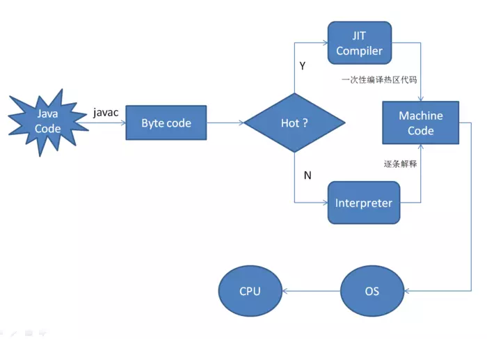

## 即时编译器（Just In Time Compiler），简称 JIT 编译器
转自参考：[JIT技术](https://www.jianshu.com/p/fbced5b34eff)

JVM的JIT编译器主要作用于热点代码，而热点代码主要包含两种类型：
* 被多次调用的方法
* 被多次执行的循环体

检测热点代码：    
判断一段代码是否是热点代码，是否需要触发即时编译，称为热点探测，以下有两种方法用于热点探测，其中HotSpot使用第二种方法：    
1. 基于采样的热点探测：采用这种方法的虚拟机会周期性地检查各个线程的栈顶，如果发现某个（或某些）方法经常出现在栈顶，那个方法就是“热点方法”
2. 基于计数器的热点探测：采用这种方法的虚拟机会为每个方法（甚至是代码块）建立计数器，统计方法的执行次数，如果次数超过一定的阈值就认为是“热点方法”。

计数器主要有方法调用计数器以及回边计数器：
* 方法调用计数器：用于统计方法被调用的次数，默认阈值在Client模式下是1500次，在Server模式下时10000次
* 回边计数器：统计一个方法中循环体代码执行的次数

两个计数器的协作（这里讨论的是方法调用计数器的情况）：当一个方法被调用时，会先检查该方法是否存在被 JIT（后文讲解） 编译过的版本，如果存在，则优先使用编译后的本地代码来执行。如果不存在已被编译过的版本，则将此方法的调用计数器加 1，然后判断方法调用计数器与回边计数器之和是否超过方法调用计数器的阈值。如果已经超过阈值，那么将会向即时编译器提交一个该方法的代码编译请求。

什么是编译和解释：    
编译器：把源程序的每一条语句都编译成机器语言，并保存成二进制文件，这样运行时计算机可以直接以机器语言来运行次程序，速度很快；    
解释器：只在执行程序时，才一条一条的解释成机器语言给计算机来执行，所以运行速度是不如编译后的程序运行的块。    
通过`javac`命令将Java程序源代码编译成Java字节码，是通常意义上的编译，但字节码并不是机器语言，要让机器进行执行，还需要把字节码翻译成机器指令，这个过程是Java虚拟机做的，这个是更为深层次的编译（实际是解释，引入JIT之后也存在编译）。** Java需要将字节码逐条翻译成对应的机器指令并且执行，这就是传统的JVM的解释器的功能，正是由于解释器逐条翻译并执行过程效率低，引入了JIT即时编译技术 **

## HotSpot JVM提供了三类参数：
转自参考：[JIT编译参数](https://www.jianshu.com/p/6bd2317ae965)、转载自[并发编程网](http://ifeve.com/)、文章链接[JVM实用参数（二）参数分类和即时（JIT）编译器诊断](http://ifeve.com/useful-jvm-flags-part-2-flag/)
1. 第一类包括了标准参数，包括了相对稳定的功能和输出的参数，可以通过java命令（或者用java -help）检索出所有标准参数。    
2. 第二类是X参数，非标准化的参数在将来的版本中可能会有所变化，所有的这类参数都以-X开始，并且可以用java -X来检索。相对来说，并不完整。
3. 是包含XX参数，相较于X参数，更偏向于实验，X参数的功能相对来说较为稳定。根据[HotSpot JVM documentation](https://www.oracle.com/technetwork/java/javase/tech/vmoptions-jsp-140102.html)的建议，不应该在不了解的情况下使用XX参数。

在JVM中，XX参数根据参数的类型不同，语法也会有所不同：    
* 对于布尔类型的参数，我们有"+"（表示添加选项）或"-"（表示移除选项），然后才设置JVM选项的实际名称
* 对于非布尔值的参数，如String或者Integer，先写参数名称，后面加上"="，最后赋值，例如，-XX:<name>=<value>

在Java开发中JIT是一种编译优化，在JVM中几个相关的配置参数是：

-XX:+PrintCompilation:     
每当一个方法被编译，就叔叔一行-XX:+PrintCompilation。每行都包含顺序号（唯一的编译任务ID）和已编译方法的名称和大小，对于static方法顺序号会被标注上"n"，而当进行循环编译时，会出现[...]     

-XX:+CITime：    
可以在JVM关闭时得到各种编译的统计信息，其中包括Total compilation time、standard compilation、 on stack replacement等

-Xint

-Xcomp

-XX:+UnlockExperimentalVMOptions:    
可以解锁一定的参数，有时候设置特定的JVM参数时，JVM会在输出“Unrecongnized VM option”后终止，如果发生这种情况，应该首先检查是否设置是参数错了，但也会存在参数设置正确，但JVM并不识别的情况，可以通过该指令解锁一些参数。

-XX:+LogCompilation:    
当使用-XX:+PrintCompilation不能提供足够的详细的信息时，可以使用该指令把扩展的便已输出写到"hotspot.log"文件中，该指令需要-XX:+UnlockExperimentalVMOptions来解锁

-XX:+PrintOptoAssembly:    
将字节码编译为本地代码，使用该指令，由编译器线程生成的本地代码被输出到"hotspot.log"文件中，使用需要运行服务端VM是debug版本
