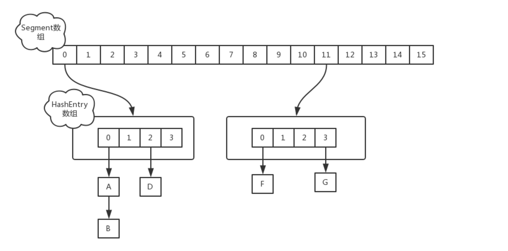

### ConcurrentHashMap
ConcurrentHashMap异步容器主要是通过将对象锁改为粒度更细的锁，默认分为16个segments并给每一个segment配置一个锁，而在存储数据的时候，将具体存储的数据划分到这16个segments中，而当有并发请求时，对该请求的segment进行加锁，来提高并发的性能，并保证数据的同步。    

将ConcurrentHashMap分成16个segments（桶），而数据键值对存放在HashEntry中，而HashEntry存放于桶的HashEntry数组中


```
// ConcurrentHashMap 类的变量
private static final long serialVersionUID = 7249069246763182397L; // 序列化UID
static final int DEFAULT_INITIAL_CAPACITY = 16; // 初始Segment数量，桶数
static final float DEFAULT_LOAD_FACTOR = 0.75F; // 负载因子 即容量百分比到达负载因子，进行扩容
static final int DEFAULT_CONCURRENCY_LEVEL = 16; // 散列表的默认并发级别为16。该值表示当前更新线程的估计数
static final int MAXIMUM_CAPACITY = 1073741824; // 最大容量 1 << 30
static final int MAX_SEGMENTS = 65536; // 最大Segment数量 1 << 16

/*
 * Number of unsynchronized retries in size and containsValue
 * methods before resorting to locking. This is used to avoid
 * unbounded retries if tables undergo continuous modification
 * which would make it impossible to obtain an accurate result.
 */
static final int RETRIES_BEFORE_LOCK = 2;
final int segmentMask;
final int segmentShift;
final Segment<K, V>[] segments;
transient Set<K> keySet;
transient Set<Map.Entry<K, V>> entrySet;
transient Collection<V> values;
```

当然划分的segment数量可以在数据初始化的时候进行设置：
```
// ConcurrentHashMap对象的构造方法
public ConcurrentHashMap(int paramInt1, float paramFloat, int paramInt2) {
  if ((paramFloat <= 0.0F) || (paramInt1 < 0) || (paramInt2 < 0)) {
    throw new IllegalArgumentException();
  }
  if (paramInt2 > MAX_SEGMENTS) {
    paramInt2 = MAX_SEGMENTS;
  }

  int i = 0;
  int j = 1;
  while (j < paramInt2) {
    ++i;
    j <<= 1;
  }
  this.segmentShift = (32 - i);
  this.segmentMask = (j - 1);
  this.segments = Segment.newArray(j);

  if (paramInt1 > MAXIMUM_CAPACITY)
    paramInt1 = MAXIMUM_CAPACITY;
  int k = paramInt1 / j;
  if (k * j < paramInt1)
    ++k;
  int l = 1;
  while (l < k) {
    l <<= 1;
  }
  for (int i1 = 0; i1 < this.segments.length; ++i1)
    this.segments[i1] = new Segment(l, paramFloat);
}

public ConcurrentHashMap(int paramInt, float paramFloat) {
  this(paramInt1, paramFloat, DEFAULT_INITIAL_CAPACITY);
}

public ConcurrentHashMap(int paramInt) {
  this(paramInt, 0.75F, DEFAULT_INITIAL_CAPACITY);
}

public ConcurrentHashMap() {
  this(16, 0.75F, DEFAULT_INITIAL_CAPACITY);
}

public ConcurrentHashMap(Map<? extends K, ? extends V> paramMap) {
  this(Math.max((int) (paramMap.size() / 0.75F) + 1, 16), 0.75F, 16);

  putAll(paramMap);
}

public void putAll(Map<? extends K, ? extends V> paramMap) {
  for(Map.Entry localEntry : paramMap.entrySet())
    put(localEntry.getKey(), localEntry.getValue());
}
```
