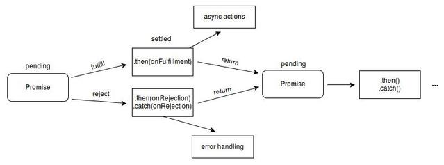

[前端项目中常用es6知识总结 -- Async、Await让异步美如画](https://www.cnblogs.com/wnn0824/p/10188914.html)

其中涉及Promise、async、await：    
[Promise对象](https://developer.mozilla.org/en-US/docs/Web/JavaScript/Reference/Global_Objects/Promise)是一个用于处理异步操作的对象。Promise对象的状态有三种：
* pending: 初始状态，既不是成功，也不是失败状态。
* fulfilled: 意味着操作成功完成。
* rejected: 意味着操作失败。

Promise对象:[ES6之Promise的使用](https://baijiahao.baidu.com/s?id=1596005633332556077&wfr=spider&for=pc)
