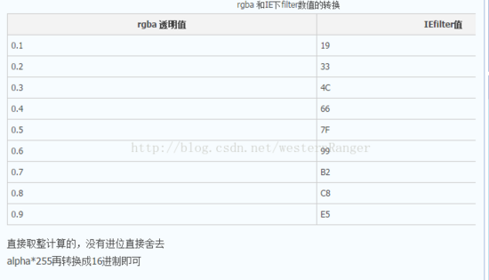

rgba函数可以实现半透明效果：    
background: rgba(255,255,255,.1);

IE8以下兼容：     
所以在ie8中设置半透明就要费点脑子了。从大神那里得知可以使用ie的filter来解决这个问题，css代码如下：

```
<span style="white-space:pre">	</span>
.color{background: rgba(255,255,255,.1);
filter:progid:DXImageTransform.Microsoft.Gradient(startColorStr=#19ffffff,endColorStr=#19ffffff);
}
// 暂时没弄出来
```

第二句话的意思就是当上一行的透明度不起作用的时候执行。这句话的意思本来是用来做渐变的。但是这个地方不需要渐变。所以两个颜色都设置成了相同的颜色。

大家注意，这个颜色“#19ffffff”是由两部分组成的。
第一部是#号后面的19 。是rgba透明度0.1的IEfilter值。从0.1到0.9每个数字对应一个IEfilter值。对应关系如下：    


参考：
* [兼容ie8 rgba()用法](https://www.cnblogs.com/zrrr/p/5211844.html)
* [不得不收藏的——IE中CSS-filter滤镜小知识大全](https://segmentfault.com/a/1190000002433305)
