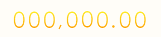

转载：[天株-数字展示变化滚动效果](http://www.cnblogs.com/zhiying/p/8085802.html)



#### 技术储备
1. jquery animate方法的使用
2. js的数组操作 parseInt charAt方法等等

#### 代码
1. CSS部分
```
<style type="text/css">
  .box{
    height: 44px;
    position: absolute;
    overflow: hidden;
    top: 50%;
    margin-top: -20px;
    margin-left: -30px;
    left: 50%;
  }
  .box span{
    display: inline-block;
     background-image: -webkit-gradient(linear,0 0,0 bottom,from(#fef637),to(#f90));
    -webkit-background-clip: text;
    -webkit-text-fill-color: transparent;
    width: 30px;
    height: 44px;
    font-size: 44px;
    line-height: 44px;
  }
  .box .sign-box span{
    width: 15px;
  }
  .box .digit-container{
    width: 30px;
    text-align: center;
    overflow: hidden;
    font-size: 0;
  }
  .l{
    float: left;
  }
</style>
```

2. HTML部分
```
<div class="js-box box"></div>
```

3. JS部分（用的JQUERY）
```
<script type="text/javascript">
$(function(){
  var lastnum = "410,134.12",lastarr = "";
  var Event = {
    // 例 510,085.00
    number: function(digit){
      var num_arr=[];
      for(var i = 0;i<digit.length;i++){
        num_arr.push(digit.charAt(i));
      }
      return num_arr;
    },
    dom: function(arr){
      var str = '';
      for(var i = 0;i<arr.length;i++){
        if(parseInt(arr[i])>=0){
          str += '<div class="l js-l-box digit-container" data-show='+arr[i]+'>\
                  <span>0</span>\
                  <span>1</span>\
                  <span>2</span>\
                  <span>3</span>\
                  <span>4</span>\
                  <span>5</span>\
                  <span>6</span>\
                  <span>7</span>\
                  <span>8</span>\
                  <span>9</span>\
                </div>';
        }else{
           str += '<div class="sign-box l"><span>'+arr[i]+'</span></div>';
        }
      }
      return str;
    },
    animation: function(){
      var height = $(".js-box").height();
      $(".js-l-box").each(function(i){
        var num = parseInt($(this).data("show"));
        var scrollTop = 0;
          var scrollTop = height * num;
          $(this).css("margin-top",0);
          $(this).animate({marginTop: -scrollTop},1500);
          console.log(scrollTop);
      });
    }
  };
  var final_arr = Event.number('510,085.12');
  $(".js-box").html(Event.dom(final_arr));
  Event.animation();
});
</script>
```
以上...

尝试调整根据当前值调整滚动效果：    
在原有的基础上，修改存储当前数据，修改data-show属性值等，之后可以考虑进行闭包，
将部分属性私有化，并只有在组件申明时可以进行设置，以及元素位置动态等方面进行优化
```
<script type="text/javascript">
$(function(){
  $("#val").change(function() {
      Event.change($(this).val());
  });

  var Event = {
    value : [],
    len : 0,
    init: function(len) {
      if(parseInt(len) < 0) return;
      this.len = len;
      var str = '';
      for(var i = 0; i < len; i++) str+='0';
      this.number1(str);
      var str = this.dom1(this.value);
      $(".js-box").html(str);
    },
    number1: function(digit){
      var newLen = digit.length;
      var len = this.len;
      var num_arr=[];
      if(newLen > len) {
        for(var i = newLen-len;i<newLen;i++){
          num_arr.push(digit.charAt(i));
        }
      } else {
        for(var i = 0; i<len-newLen;i++) num_arr.push('0');
        for(var i = 0;i<newLen;i++){
          num_arr.push(digit.charAt(i));
        }
      }
      this.value = num_arr;
    },
    dom1: function(arr){
      var str = '';
      for(var i = 0;i<arr.length;i++){
        str += '<div class="l js-l-box digit-container" data-index='+i+' data-show='+arr[i]+'>\
                <span>0</span>\
                <span>1</span>\
                <span>2</span>\
                <span>3</span>\
                <span>4</span>\
                <span>5</span>\
                <span>6</span>\
                <span>7</span>\
                <span>8</span>\
                <span>9</span>\
              </div>';
      }
      return str;
    },
    change:function(newNum) {
      var oldNums = this.value;
      this.number1(newNum);
      var newNums = this.value;
      var height = $(".js-box").height();
      $(".js-l-box").each(function(i){
        $(this).attr("data-show", newNums[i]);
        var num = parseInt(newNums[i]) - parseInt(oldNums[i]);
        console.log('num',num);
        var scrollTop = height * num;
        //$(this).css("margin-top",0);
        $(this).animate({marginTop: "-="+scrollTop+"px"},1500);
        //console.log(scrollTop);
      });
      this.value = newNums;
    },
    // 例 510,085.00
    number0: function(digit){
      var num_arr=[];
      for(var i = 0;i<digit.length;i++){
        num_arr.push(digit.charAt(i));
      }
      return num_arr;
    },
    dom0: function(arr){
      var str = '';
      for(var i = 0;i<arr.length;i++){
        if(parseInt(arr[i])>=0){
          str += '<div class="l js-l-box digit-container" data-show='+arr[i]+'>\
                  <span>0</span>\
                  <span>1</span>\
                  <span>2</span>\
                  <span>3</span>\
                  <span>4</span>\
                  <span>5</span>\
                  <span>6</span>\
                  <span>7</span>\
                  <span>8</span>\
                  <span>9</span>\
                </div>';
        }else{
           str += '<div class="sign-box l"><span>'+arr[i]+'</span></div>';
        }
      }
      return str;
    },
    animation: function(){
      var height = $(".js-box").height();
      $(".js-l-box").each(function(i){
        var num = parseInt($(this).data("show"));
        var scrollTop = 0;
          var scrollTop = height * num;
          $(this).css("margin-top",0);
          $(this).animate({marginTop: -scrollTop},1500);
          //console.log(scrollTop);
      });
    }
  };
  //var final_arr = Event.number('510,085.12');
  //$(".js-box").html(Event.dom(final_arr));
  //Event.animation();
  Event.init(10);
});
</script>
```
